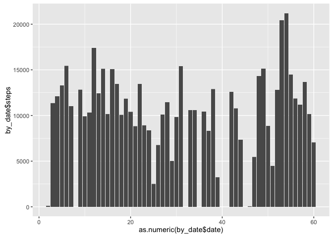
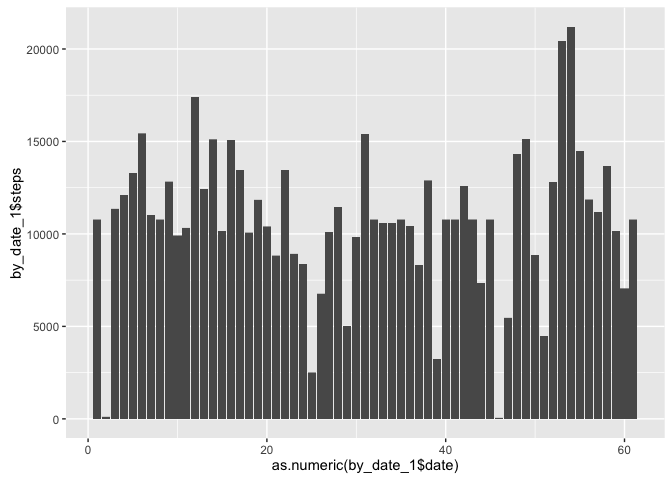
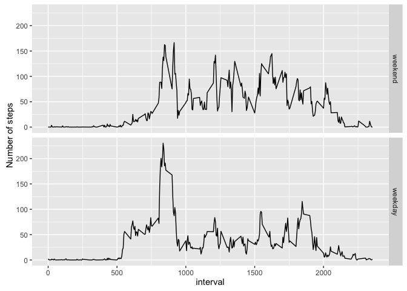

# Reproducible Research: Peer Assessment 1


******
## Loading and preprocessing the data
******

```r
df <- read.csv("activity.csv", header=TRUE, na.string="NA")
```

******
## What is mean total number of steps taken per day?
******
#### Load libraries used in the following

```r
library(dplyr)
```

```
## 
## Attaching package: 'dplyr'
```

```
## The following objects are masked from 'package:stats':
## 
##     filter, lag
```

```
## The following objects are masked from 'package:base':
## 
##     intersect, setdiff, setequal, union
```

```r
library(ggplot2)
```

```
## Warning: package 'ggplot2' was built under R version 3.2.3
```

#### Ignore the missing values for this part of the assignment.

```r
df_ignoreNA <- df[complete.cases(df),]
```

#### Calculate the total number of steps taken per day

```r
by_date <- group_by(df_ignoreNA[c("date", "steps")], date)
by_date_sum <- summarize(by_date, total = sum(steps))
knitr::kable(by_date_sum)
```


date          total
-----------  ------
2012-10-02      126
2012-10-03    11352
2012-10-04    12116
2012-10-05    13294
2012-10-06    15420
2012-10-07    11015
2012-10-09    12811
2012-10-10     9900
2012-10-11    10304
2012-10-12    17382
2012-10-13    12426
2012-10-14    15098
2012-10-15    10139
2012-10-16    15084
2012-10-17    13452
2012-10-18    10056
2012-10-19    11829
2012-10-20    10395
2012-10-21     8821
2012-10-22    13460
2012-10-23     8918
2012-10-24     8355
2012-10-25     2492
2012-10-26     6778
2012-10-27    10119
2012-10-28    11458
2012-10-29     5018
2012-10-30     9819
2012-10-31    15414
2012-11-02    10600
2012-11-03    10571
2012-11-05    10439
2012-11-06     8334
2012-11-07    12883
2012-11-08     3219
2012-11-11    12608
2012-11-12    10765
2012-11-13     7336
2012-11-15       41
2012-11-16     5441
2012-11-17    14339
2012-11-18    15110
2012-11-19     8841
2012-11-20     4472
2012-11-21    12787
2012-11-22    20427
2012-11-23    21194
2012-11-24    14478
2012-11-25    11834
2012-11-26    11162
2012-11-27    13646
2012-11-28    10183
2012-11-29     7047

#### The Histogram of the total number of steps taken each day

```r
ggplot(by_date, aes(x=as.numeric(by_date$date), y=by_date$steps)) + geom_bar(stat="identity")
```



#### The mean and median of the total number of steps taken per day

```r
cat("mean of the total number of steps taken per day: ", mean(by_date_sum$total))
```

```
## mean of the total number of steps taken per day:  10766.19
```

```r
cat("median of the total number of steps taken per day: ", median(by_date_sum$total))
```

```
## median of the total number of steps taken per day:  10765
```

******
## What is the average daily activity pattern?
******
#### Time series plot

```r
by_interval <- group_by(df_ignoreNA[c("steps", "interval")], interval)
by_interval_sum <- summarize(by_interval, mean = mean(steps))
plot(by_interval_sum$interval, by_interval_sum$mean, type="l", xlab="Interval", ylab="Average Number of Steps")
```


#### Find the interval with the maximum average number of steps.

```r
cat("The interval with maximum activity: ", by_interval_sum$interval[which.max(by_interval_sum$mean)])
```

```
## The interval with maximum activity:  835
```

******
## Imputting missing values
******

```r
cat("The total number of missing values in the dataset is : ", sum(is.na(df)))
```

```
## The total number of missing values in the dataset is :  2304
```

#### Filling in the missing values with the mean steps number from the same interval.

```r
fillNaWithMean <- function(df, df_interval){
  if (is.na(df["steps"])){
    avg <- df_interval$mean[which(df_interval$interval == as.numeric(df["interval"]))]
    result <- as.double(avg)
  }
  else
    result <- as.double(df["steps"])
  return(result)   
}
```

#### Create the dataset with the missing data filled in.

```r
df_imputted <- df
df_imputted$steps <- apply(df, 1, fillNaWithMean, df_interval=by_interval_sum)
```

#### The histogram of the total number of steps taken each day

```r
by_date_1 <- group_by(df_imputted[c("date", "steps")], date)
by_date_1_sum <- summarize(by_date_1, total = sum(steps))
ggplot(by_date_1, aes(x=as.numeric(by_date_1$date), y=by_date_1$steps)) + geom_bar(stat="identity")
```



```r
cat("mean of the total number of steps taken per day (imputted): ", mean(by_date_1_sum$total))
```

```
## mean of the total number of steps taken per day (imputted):  10766.19
```

```r
cat("median of the total number of steps taken per day (imputted): ", median(by_date_1_sum$total))
```

```
## median of the total number of steps taken per day (imputted):  10766.19
```

```r
cat("diff in mean of the total number of steps taken per day: ", mean(by_date_1_sum$total) - mean(by_date_sum$total))
```

```
## diff in mean of the total number of steps taken per day:  0
```

```r
cat("diff in median of the total number of steps taken per day: ", median(by_date_1_sum$total) - median(by_date_sum$total))
```

```
## diff in median of the total number of steps taken per day:  1.188679
```

******
## Are there differences in activity patterns between weekdays and weekends?
******

#### create a new factor variable in the dataset with two levels -- "weekday" and "weekend" indicating #### whether a given date is a weekday or weekend day.

```r
df_imputted$weekday <- factor((weekdays(as.Date(df_imputted$date)) %in% c('Saturday', 'Sunday')), levels=c(TRUE, FALSE), labels=c('weekend', 'weekday'))
```

#### The panel plot that shows the difference in activity patterns.  

```r
by_interval_1 <- group_by(df_imputted, interval, weekday)
by_interval_1_sum <- summarize(by_interval_1, mean = mean(steps))
qplot(interval, mean, data = by_interval_1_sum, geom = c("line"), facets = weekday ~ .) + ylab("Number of steps")
```




